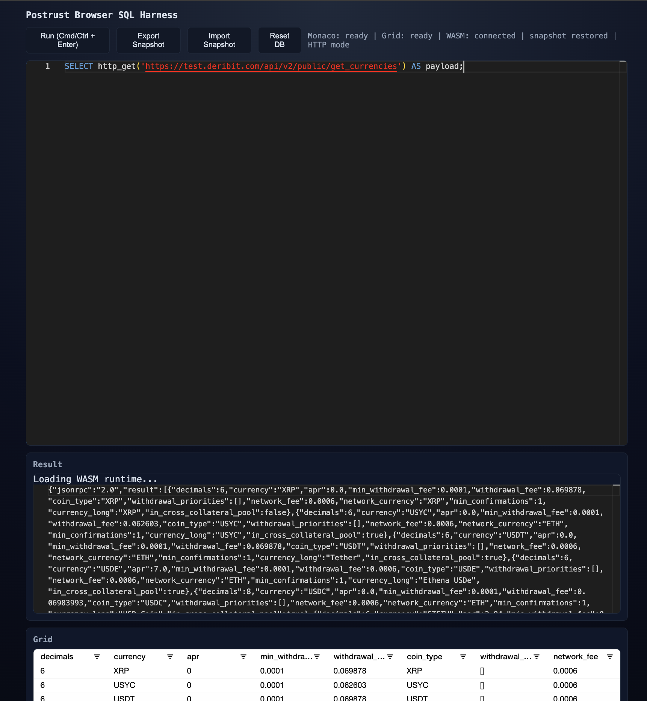

<p align="center">
  
</p>

# OpenAssay

**An async-native, PostgreSQL-compatible SQL engine in Rust — where network data sources are first-class SQL primitives.**

OpenAssay treats HTTP APIs, WebSockets, and remote data feeds as things you query, not things you preprocess. Write SQL that fetches, transforms, and joins live data in a single statement — no Python glue, no ETL pipelines, no waiting.

```sql
-- Fetch live BTC derivatives data from Deribit and query it with SQL
CREATE EXTENSION http;
SELECT result->>'last_price' AS last_price,
       result->'stats'->>'volume' AS volume_24h,
       result->'stats'->>'high' AS high_24h,
       result->'stats'->>'low' AS low_24h
FROM (
  SELECT json_extract_path_text(
           http_get('https://www.deribit.com/api/v2/public/ticker?instrument_name=BTC-PERPETUAL'),
           'content'
         ) AS response
) t,
     jsonb_each(response) AS kv(key, result)
WHERE key = 'result';
```

Runs natively on Linux/macOS **and in the browser via WASM**. [Try it live →](https://rosssaunders.github.io/openassay)

## Demo

### CLI — connect with psql


*CREATE TABLE, window functions, JSON, CTEs, and live HTTP fetching via psql.*

### Browser — runs entirely in WASM


*Live cryptocurrency data from Deribit API, queried with SQL — running in the browser with zero backend.*

## Why async matters

Most embeddable SQL engines block on I/O. That's fine for local files, but useless when your data lives behind an API.

OpenAssay is **async all the way through** — from expression evaluation to query execution. This means:

- **`http_get()`/`http_post()`/`http_head()` (via `CREATE EXTENSION http`)** fetch data without blocking the engine
- **WebSocket streams** can be queried as virtual tables (`SELECT * FROM ws.messages`)
- **WASM builds** use native browser `fetch()` and `WebSocket` — no sync XHR hacks, no thread emulation
- **Multiple concurrent data sources** can be queried in the same statement without serialising requests

This makes OpenAssay uniquely suited for **data analytics against live APIs** — the kind of work that usually requires Python/Pandas/requests just to get data into a queryable shape.

## PostgreSQL compatibility

**100% pass rate** on 39 PostgreSQL 18 regression test files — **12,329 / 12,329 statements passing**.

**Target: PostgreSQL 18** (current release). OpenAssay tracks the latest PostgreSQL version only — there is no backwards compatibility with older Postgres versions. When PostgreSQL ships a new major release, we update to match. This keeps the codebase clean and lets us adopt new syntax and semantics without carrying legacy baggage.

### Regression test results

39 test files from the PostgreSQL 18 regression suite run against OpenAssay with **100% compatibility**:

| File | Statements | | File | Statements |
|------|------------|---|------|------------|
| select.sql | 87/87 | | insert.sql | 397/397 |
| select_distinct.sql | 105/105 | | update.sql | 303/303 |
| select_having.sql | 23/23 | | delete.sql | 10/10 |
| select_implicit.sql | 44/44 | | insert_conflict.sql | 265/265 |
| join.sql | 919/919 | | merge.sql | 645/645 |
| subselect.sql | 365/365 | | create_table.sql | 339/339 |
| aggregates.sql | 619/619 | | create_view.sql | 311/311 |
| window.sql | 429/429 | | create_index.sql | 685/685 |
| union.sql | 207/207 | | sequence.sql | 261/261 |
| case.sql | 70/70 | | explain.sql | 77/77 |
| with.sql | 314/314 | | matview.sql | 187/187 |
| boolean.sql | 98/98 | | groupingsets.sql | 219/219 |
| strings.sql | 550/550 | | date.sql | 271/271 |
| text.sql | 73/73 | | time.sql | 44/44 |
| int2.sql | 76/76 | | timestamp.sql | 177/177 |
| int4.sql | 94/94 | | interval.sql | 450/450 |
| int8.sql | 174/174 | | arrays.sql | 529/529 |
| float4.sql | 100/100 | | json.sql | 469/469 |
| float8.sql | 184/184 | | jsonb.sql | 1,100/1,100 |
| numeric.sql | 1,059/1,059 | | | |

### Regression tests not yet included

The full PostgreSQL 18 regression suite contains ~120 test files. The following 84 are **not yet tested** because they exercise functionality OpenAssay doesn't implement (being a query engine, not a full database server):

**Storage & indexing** — `btree_index`, `hash_index`, `brin`, `gin`, `gist`, `spgist`, `create_index_spgist`, `index_including`, `index_including_gist`, `hash_part`, `indexing`, `create_am`, `hash_func`, `tuplesort`, `compression`, `memoize`, `reloptions`, `tablespace`, `stats_ext`

**Transactions & MVCC** — `transactions`, `prepared_xacts`, `lock`, `replica_identity`, `vacuum`, `txid`, `xid`, `pg_lsn`

**Table inheritance & partitioning** — `inherit`, `typed_table`, `partition_join`, `partition_prune`, `partition_aggregate`, `partition_info`

**Triggers & rules** — `triggers`, `updatable_views`

**Roles & security** — `rolenames`, `roleattributes`, `privileges`, `init_privs`, `rowsecurity`, `security_label`, `object_address`

**Types not yet implemented** — `bit`, `char`, `varchar`, `name`, `oid`, `uuid`, `enum`, `money`, `rangetypes`, `rangefuncs`, `domain`, `polymorphism`

**DDL & utility** — `alter_table`, `alter_generic_table`, `create_type`, `create_table_like`, `create_operator`, `drop_operator`, `create_procedure`, `create_function_c`, `create_function_sql`, `create_misc`, `drop_if_exists`, `truncate`, `namespace`, `temp`, `tablesample`, `select_into`, `select_distinct_on`, `conversion`, `prepare`, `portals`, `errors`, `random`

**COPY variants** — `copy`, `copy2`, `copyselect`, `copydml`

**Other** — `collate`, `md5`, `regproc`

Many of these are not applicable to OpenAssay's architecture (e.g., WAL, vacuum, tablespaces, storage-level indexing). Others represent future work as the query engine expands.

### ✅ Language features

| Feature | Status |
|---------|--------|
| SELECT, INSERT, UPDATE, DELETE, MERGE | ✅ |
| JOINs (INNER, LEFT, RIGHT, FULL, CROSS) | ✅ |
| Subqueries (scalar, correlated, EXISTS, IN) | ✅ |
| CTEs (WITH, WITH RECURSIVE) | ✅ |
| Window functions (ROW_NUMBER, RANK, DENSE_RANK, LAG, LEAD, NTILE, FIRST_VALUE, LAST_VALUE, NTH_VALUE, PERCENT_RANK, CUME_DIST + aggregates over windows) | ✅ |
| UNION / INTERSECT / EXCEPT (+ ALL) | ✅ |
| GROUP BY, HAVING, ORDER BY, LIMIT, OFFSET | ✅ |
| DISTINCT, DISTINCT ON | ✅ |
| CASE / WHEN / COALESCE / NULLIF / GREATEST / LEAST | ✅ |
| LIKE / ILIKE / BETWEEN / IS [NOT] DISTINCT FROM | ✅ |
| CAST / :: type coercion | ✅ |
| INSERT ... ON CONFLICT (upsert) | ✅ |
| RETURNING clauses | ✅ |
| EXPLAIN / EXPLAIN ANALYZE | ✅ |
| CREATE TABLE, VIEW, INDEX, SEQUENCE, SCHEMA | ✅ |
| ALTER TABLE (ADD/DROP/RENAME column, constraints) | ✅ |
| Materialized views (CREATE, REFRESH) | ✅ |
| DO blocks | ✅ |
| SET / SHOW / RESET | ✅ |
| CREATE / DROP EXTENSION | ✅ |
| CREATE FUNCTION (SQL body) | ✅ |
| CREATE/DROP SUBSCRIPTION (logical replication) | ✅ |
| Transactions (BEGIN, COMMIT, ROLLBACK, SAVEPOINT) | ✅ |
| PostgreSQL wire protocol (psql, DBeaver, any PG client) | ✅ |
| LATERAL JOIN | ✅ |
| GROUPING SETS / ROLLUP / CUBE | ✅ |
| ARRAY constructors (`ARRAY[1,2,3]`) | ✅ |
| FILTER clause on aggregates | ✅ |
| ANY / ALL subqueries | ✅ |
| WITHIN GROUP (ordered-set aggregates) | ✅ |
| GRANT / REVOKE table privileges | ✅ |
| Row-level security (RLS) policies | ✅ |
| COPY TO/FROM (text and CSV) | ✅ |

Parser coverage includes COPY plus CREATE/ALTER/DROP ROLE and GRANT/REVOKE, so these statements now flow through the formal AST pipeline.

Planner coverage includes CTEs, set operations, window functions, aggregates, DISTINCT, ORDER BY, LIMIT/OFFSET, subqueries, and LATERAL joins, with PassThrough fallback only on planning errors.

### ✅ Built-in functions (170+ implemented)

**String:** `length`, `lower`, `upper`, `trim`, `btrim`, `ltrim`, `rtrim`, `substring`, `substr`, `left`, `right`, `replace`, `reverse`, `repeat`, `lpad`, `rpad`, `initcap`, `concat`, `concat_ws`, `split_part`, `strpos`, `translate`, `format`, `regexp_replace`

**Math:** `abs`, `ceil`, `floor`, `round`, `sign`, `sqrt`, `cbrt`, `pow`, `exp`, `ln`, `log`, `pi`, `sin`, `cos`, `tan`, `asin`, `acos`, `atan`, `degrees`, `radians`, `div`, `mod`, `gcd`, `lcm`, `random`

**Date/Time:** `now`, `current_date`, `current_timestamp`, `date_part`, `extract`, `date_trunc`, `date_add`, `date_sub`, `make_date`, `make_timestamp`, `to_char`

**JSON/JSONB (35+ functions):** `jsonb_each`, `jsonb_each_text`, `jsonb_array_elements`, `jsonb_array_length`, `jsonb_object_keys`, `jsonb_build_object`, `jsonb_build_array`, `jsonb_set`, `jsonb_insert`, `jsonb_strip_nulls`, `jsonb_pretty`, `jsonb_typeof`, `jsonb_extract_path`, `jsonb_extract_path_text`, `jsonb_path_query`, `jsonb_path_exists`, `jsonb_path_match`, `jsonb_populate_record`, `jsonb_populate_recordset`, `jsonb_to_record`, `jsonb_to_recordset`, `jsonb_agg`, `jsonb_object_agg`, `row_to_json`, `to_jsonb`, `array_to_json`, `json_object`, `->`, `->>`, `#>`, `#>>`, `delete_key`

**Aggregate:** `count`, `sum`, `avg`, `min`, `max`, `bool_or`, `every`, `string_agg`, `array_agg`, `jsonb_agg`, `jsonb_object_agg`, `stddev_pop`, `stddev_samp`, `var_pop`, `var_samp`

**Window:** `row_number`, `rank`, `dense_rank`, `percent_rank`, `cume_dist`, `ntile`, `lag`, `lead`, `first_value`, `last_value`, `nth_value`

**Other:** `generate_series`, `unnest`, `coalesce`, `nullif`, `greatest`, `least`, `version`, `pg_backend_pid`, `current_database`, `current_schema`, sequences (`nextval`, `currval`, `setval`)

**HTTP extension:** `http_get`, `http_post`, `http_put`, `http_patch`, `http_delete`, `http_head`, `urlencode` (requires `CREATE EXTENSION http`)

### 🔜 Functions roadmap

| Category | Planned additions |
|----------|-------------------|
| **String** | `encode/decode`, `md5`, `sha256`, `regexp_match`, `regexp_matches`, `regexp_split_to_table`, `overlay`, `position`, `ascii`, `chr`, `quote_literal`, `quote_ident` |
| **Date/Time** | `age()`, `clock_timestamp()`, `to_timestamp()`, `timezone()`, `make_interval`, `justify_hours/days/interval`, `isfinite` |
| **Math** | `trunc(numeric,int)`, `width_bucket`, `scale`, `min_scale` |
| **JSON** | `jsonb_concat (\|\|)`, `@>`, `<@`, `?`, `?\|`, `?&` operators |
| **Array** | `array_append`, `array_prepend`, `array_cat`, `array_remove`, `array_replace`, `array_position`, `array_length`, `array_dims`, `cardinality` |
| **Aggregate** | `percentile_cont`, `percentile_disc`, `mode()`, `corr`, `covar_pop/samp`, `regr_*` family |
| **System** | `pg_typeof`, `pg_column_size`, `pg_total_relation_size`, `obj_description`, `col_description` |

### Async data sources

- `http_get(url)` — fetch any URL (returns JSON response with status, content_type, headers, content)
- `http_post/http_put/http_patch/http_delete/http_head` — pgsql-http-compatible helpers
- `urlencode(text)` — URL encode a string
- `CREATE EXTENSION http` is required before calling HTTP functions
- WebSocket extension: `ws.connect()`, `ws.send()`, `ws.recv()`, `ws.messages` virtual table
- CREATE FUNCTION with SQL bodies for custom logic

### Type system

TEXT, INTEGER, BIGINT, FLOAT, DOUBLE PRECISION, BOOLEAN, NUMERIC, DATE, TIMESTAMP, TIMESTAMPTZ, INTERVAL, JSON, JSONB, UUID, BYTEA, arrays, NULL

### System catalogs

`pg_class`, `pg_namespace`, `pg_type`, `pg_attribute`, `pg_index`, `pg_constraint`, `pg_sequence`, `pg_depend`, `pg_extension`, `pg_proc`, `pg_am`, `pg_roles`, `pg_settings`, `information_schema.tables`, `information_schema.columns`

## Screenshot



## Quick Start

```bash
# Build and test
cargo test
cargo clippy -- -D warnings

# PostgreSQL-compatible server
cargo run --bin pg_server -- 55432
# Connect: psql -h 127.0.0.1 -p 55432

# Browser/WASM harness
scripts/build_wasm.sh
cargo run --bin web_server -- 8080
# Open: http://127.0.0.1:8080
```

## Platforms

- **Native** (Linux, macOS) — Tokio + reqwest for async I/O
- **Browser/WASM** — wasm-bindgen + web-sys fetch/WebSocket

## Logical replication

OpenAssay can act as a **logical replication target** for a real PostgreSQL database. It subscribes to a publication and keeps an in-memory replica of the published tables, streaming INSERTs, UPDATEs, and DELETEs in real time via the pgoutput protocol.

This means you can point OpenAssay at a production Postgres and query a live, read-only copy of your data — joined with external API data — without touching the source database.

### Setting up the upstream (PostgreSQL)

Your upstream PostgreSQL needs logical replication enabled:

```ini
# postgresql.conf
wal_level = logical
max_replication_slots = 4
max_wal_senders = 4
```

Create a publication for the tables you want to replicate:

```sql
-- On upstream PostgreSQL
CREATE PUBLICATION my_pub FOR TABLE users, orders;
-- Or replicate everything:
-- CREATE PUBLICATION my_pub FOR ALL TABLES;
```

Create a replication user (or use an existing superuser for testing):

```sql
CREATE ROLE replicator WITH REPLICATION LOGIN PASSWORD 'secret';
GRANT SELECT ON ALL TABLES IN SCHEMA public TO replicator;
```

### Starting OpenAssay as a replication target

```bash
# Start the OpenAssay wire-protocol server
cargo run --bin pg_server -- 127.0.0.1:55432
```

Connect to OpenAssay (via `psql`, DBeaver, or any PG client) and create matching target tables:

```sql
-- On OpenAssay (psql -h 127.0.0.1 -p 55432)
CREATE TABLE users (
  id SERIAL PRIMARY KEY,
  name TEXT NOT NULL,
  email TEXT,
  created_at TIMESTAMP DEFAULT NOW()
);

CREATE TABLE orders (
  id SERIAL PRIMARY KEY,
  user_id INTEGER,
  amount NUMERIC(10,2) NOT NULL,
  status TEXT DEFAULT 'pending'
);
```

Then create the subscription:

```sql
CREATE SUBSCRIPTION my_sub
  CONNECTION 'host=your-pg-host port=5432 dbname=mydb user=replicator password=secret'
  PUBLICATION my_pub
  WITH (copy_data = true);
```

### What happens next

1. **Initial sync** (`copy_data = true`): OpenAssay copies all existing rows from the published tables
2. **Streaming**: OpenAssay creates a logical replication slot and streams WAL changes — every INSERT, UPDATE, and DELETE on the upstream is applied to the in-memory tables in real time
3. **Query freely**: The replicated tables are now queryable with full SQL, including joins with HTTP data sources

```sql
-- Join replicated production data with a live API
CREATE EXTENSION http;

SELECT u.name, u.email, o.amount,
       http_get('https://api.example.com/enrichment/' || u.id) AS profile
FROM users u
JOIN orders o ON o.user_id = u.id
WHERE o.status = 'pending';
```

### Limitations

- **In-memory only** — if OpenAssay restarts, it re-syncs from scratch (initial copy + streaming catch-up)
- **Read-only replica** — writes to replicated tables in OpenAssay don't propagate back to upstream
- **Schema changes** — DDL on the upstream (e.g. `ALTER TABLE`) requires manually updating the OpenAssay target tables and re-subscribing

### Running the integration test

The test suite spins up a real PostgreSQL in Docker, creates tables and a publication, starts OpenAssay, subscribes, and verifies initial sync + streaming INSERT/UPDATE/DELETE:

```bash
cd tests/integration
npm install
npm test
```

## Project Layout

```
src/
├── parser/              # SQL lexer, AST, parser (5k lines)
│   ├── lexer.rs         # Token scanner
│   ├── ast.rs           # AST node types (74 types)
│   ├── sql_parser.rs    # Recursive-descent parser
│   └── scansup.rs       # Identifier handling (PG's scansup.c)
├── analyzer/            # Semantic analysis (name binding, type checking, function resolution)
│   ├── mod.rs           # Entry point — analyze() validation pass
│   ├── binding.rs       # Name binding and scope resolution
│   ├── types.rs         # Type inference and coercion rules
│   └── functions.rs     # Function/operator resolution and arg validation
├── planner/             # Query planner/optimizer (logical/physical plans, cost, stats)
├── catalog/             # In-memory catalog (schemas, tables, OIDs)
│   ├── mod.rs           # Core catalog API
│   ├── schema.rs        # Schema management
│   ├── table.rs         # Table metadata
│   ├── oid.rs           # OID allocator
│   ├── search_path.rs   # Name resolution / search_path
│   ├── dependency.rs    # Object dependency graph (CASCADE/RESTRICT)
│   └── system_catalogs.rs  # pg_class, pg_type, information_schema, etc.
├── commands/            # DDL command handlers
│   ├── create_table.rs, drop.rs, alter.rs
│   ├── view.rs, matview.rs, index.rs, sequence.rs, schema.rs
│   ├── function.rs, extension.rs, variable.rs
│   ├── explain.rs, do_block.rs
│   └── mod.rs
├── executor/            # Query executor nodes
│   ├── exec_main.rs     # Main execution dispatch
│   ├── exec_expr.rs     # Expression evaluation
│   ├── exec_scan.rs     # Sequential scan
│   ├── exec_grouping.rs # GROUPING SETS / ROLLUP / CUBE
│   ├── exec_srf.rs      # Set-returning functions
│   ├── node_agg.rs      # Aggregation
│   ├── node_hash_join.rs, node_merge_join.rs, node_nested_loop.rs
│   ├── node_window_agg.rs, node_sort.rs, node_limit.rs
│   ├── node_cte.rs, node_subquery.rs, node_set_op.rs
│   ├── node_modify_table.rs, node_append.rs, node_result.rs
│   └── mod.rs
├── storage/             # In-memory row storage
│   ├── heap.rs          # Heap table storage
│   └── tuple.rs         # Tuple representation
├── access/transam/      # Transaction management
│   ├── snapshot.rs      # MVCC snapshots
│   ├── visibility.rs    # Tuple visibility
│   └── xact.rs          # Transaction state
├── security/            # Security model
│   ├── roles.rs         # Role management
│   ├── acl.rs           # GRANT/REVOKE privileges
│   └── rls.rs           # Row-level security policies
├── protocol/            # PostgreSQL wire protocol
│   ├── messages.rs      # Message encoding/decoding
│   ├── startup.rs       # Connection handshake
│   └── copy.rs          # COPY protocol
├── tcop/                # Traffic cop (query dispatch)
│   ├── engine.rs        # Core execution engine (3k lines)
│   ├── postgres.rs      # Wire protocol session handler (5k lines)
│   ├── pquery.rs        # Portal/prepared statement management
│   └── utility.rs       # Utility command dispatch
├── utils/adt/           # Built-in data type functions
│   ├── json.rs, datetime.rs, math_functions.rs
│   ├── string_functions.rs, misc.rs
│   └── mod.rs
├── browser.rs           # WASM/browser bindings
├── bin/pg_server.rs     # TCP PostgreSQL server
├── bin/web_server.rs    # HTTP server for WASM harness
└── main.rs              # CLI entry point
web/                     # Browser harness UI
tests/                   # Regression + differential test suites (365 tests)
implementation-plan/     # Staged PostgreSQL parity roadmap
```

## Architecture: query engine, not database server

OpenAssay is a **query engine**, not a general-purpose database. It doesn't implement MVCC, WAL, row-level locking, or durable storage — your data lives in APIs, files, and streams. OpenAssay just lets you query it.

This is a deliberate design choice:

- **No process-per-connection model.** PostgreSQL spawns a heavyweight OS process for each client connection and uses shared memory for IPC. OpenAssay uses an async runtime — a single thread can serve many concurrent queries, yielding on network I/O instead of blocking.
- **No MVCC or locking.** There are no concurrent writers contending for the same rows. Tables are ephemeral scratch space for intermediate results, not the source of truth. This eliminates an entire class of complexity (tuple versioning, vacuum, snapshot isolation, deadlock detection).
- **No WAL or durability.** If the process exits, the data is gone — and that's fine, because the data came from an API and can be re-fetched. The source of truth is the external system, not OpenAssay.

This matters for the async story: in traditional PostgreSQL, an `http_get()` call (via `pgsql-http`) blocks the entire backend process. OpenAssay's async execution means a query waiting on a slow API doesn't block anything — other queries continue executing on the same thread. When your "tables" are API endpoints with 200ms latency, this is the difference between usable and unusable.

**In short:** PostgreSQL is a storage engine with a query engine on top. OpenAssay is a query engine with the network as its storage.

## The vision

SQL is the best language for data analysis. But getting data *into* SQL is the hard part — you end up writing Python scripts to fetch from APIs, parse JSON, clean it up, load it into a database, and *then* query it.

OpenAssay collapses that pipeline. Your SQL *is* the data pipeline. Fetch, transform, join, and analyse — all in one async query.

## License

MIT
