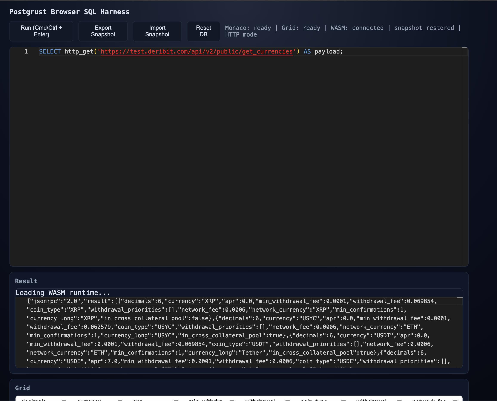

# Postrust

**An async-native, PostgreSQL-compatible SQL engine in Rust — where network data sources are first-class SQL primitives.**

Postrust treats HTTP APIs, WebSockets, and remote data feeds as things you query, not things you preprocess. Write SQL that fetches, transforms, and joins live data in a single statement — no Python glue, no ETL pipelines, no waiting.

```sql
-- Fetch live BTC derivatives data from Deribit and query it with SQL
CREATE EXTENSION http;
SELECT result->>'last_price' AS last_price,
       result->'stats'->>'volume' AS volume_24h,
       result->'stats'->>'high' AS high_24h,
       result->'stats'->>'low' AS low_24h
FROM (
  SELECT json_extract_path_text(
           http_get('https://www.deribit.com/api/v2/public/ticker?instrument_name=BTC-PERPETUAL'),
           'content'
         ) AS response
) t,
     jsonb_each(response) AS kv(key, result)
WHERE key = 'result';
```

Runs natively on Linux/macOS **and in the browser via WASM**. [Try it live →](https://rosssaunders.github.io/postrust)

## Why async matters

Most embeddable SQL engines block on I/O. That's fine for local files, but useless when your data lives behind an API.

Postrust is **async all the way through** — from expression evaluation to query execution. This means:

- **`http_get()`/`http_post()`/`http_head()` (via `CREATE EXTENSION http`)** fetch data without blocking the engine
- **WebSocket streams** can be queried as virtual tables (`SELECT * FROM ws.messages`)
- **WASM builds** use native browser `fetch()` and `WebSocket` — no sync XHR hacks, no thread emulation
- **Multiple concurrent data sources** can be queried in the same statement without serialising requests

This makes Postrust uniquely suited for **data analytics against live APIs** — the kind of work that usually requires Python/Pandas/requests just to get data into a queryable shape.

## PostgreSQL compatibility

### ✅ Language features

| Feature | Status |
|---------|--------|
| SELECT, INSERT, UPDATE, DELETE, MERGE | ✅ |
| JOINs (INNER, LEFT, RIGHT, FULL, CROSS) | ✅ |
| Subqueries (scalar, correlated, EXISTS, IN) | ✅ |
| CTEs (WITH, WITH RECURSIVE) | ✅ |
| Window functions (ROW_NUMBER, RANK, DENSE_RANK, LAG, LEAD, NTILE, FIRST_VALUE, LAST_VALUE, NTH_VALUE, PERCENT_RANK, CUME_DIST + aggregates over windows) | ✅ |
| UNION / INTERSECT / EXCEPT (+ ALL) | ✅ |
| GROUP BY, HAVING, ORDER BY, LIMIT, OFFSET | ✅ |
| DISTINCT, DISTINCT ON | ✅ |
| CASE / WHEN / COALESCE / NULLIF / GREATEST / LEAST | ✅ |
| LIKE / ILIKE / BETWEEN / IS [NOT] DISTINCT FROM | ✅ |
| CAST / :: type coercion | ✅ |
| INSERT ... ON CONFLICT (upsert) | ✅ |
| RETURNING clauses | ✅ |
| EXPLAIN / EXPLAIN ANALYZE | ✅ |
| CREATE TABLE, VIEW, INDEX, SEQUENCE, SCHEMA | ✅ |
| ALTER TABLE (ADD/DROP/RENAME column, constraints) | ✅ |
| Materialized views (CREATE, REFRESH) | ✅ |
| DO blocks | ✅ |
| SET / SHOW / RESET | ✅ |
| CREATE / DROP EXTENSION | ✅ |
| CREATE FUNCTION (SQL body) | ✅ |
| CREATE/DROP SUBSCRIPTION (logical replication) | ✅ |
| Transactions (BEGIN, COMMIT, ROLLBACK, SAVEPOINT) | ✅ |
| PostgreSQL wire protocol (psql, DBeaver, any PG client) | ✅ |
| LATERAL JOIN | ✅ |
| GROUPING SETS / ROLLUP / CUBE | ✅ |
| ARRAY constructors (`ARRAY[1,2,3]`) | ✅ |
| FILTER clause on aggregates | ✅ |
| ANY / ALL subqueries | ✅ |
| WITHIN GROUP (ordered-set aggregates) | ✅ |
| GRANT / REVOKE table privileges | ✅ |
| Row-level security (RLS) policies | ✅ |
| COPY TO/FROM (text and CSV) | ✅ |

Parser coverage includes COPY plus CREATE/ALTER/DROP ROLE and GRANT/REVOKE, so these statements now flow through the formal AST pipeline.

Planner coverage includes CTEs, set operations, window functions, aggregates, DISTINCT, ORDER BY, LIMIT/OFFSET, subqueries, and LATERAL joins, with PassThrough fallback only on planning errors.

### ✅ Built-in functions (170+ implemented)

**String:** `length`, `lower`, `upper`, `trim`, `btrim`, `ltrim`, `rtrim`, `substring`, `substr`, `left`, `right`, `replace`, `reverse`, `repeat`, `lpad`, `rpad`, `initcap`, `concat`, `concat_ws`, `split_part`, `strpos`, `translate`, `format`, `regexp_replace`

**Math:** `abs`, `ceil`, `floor`, `round`, `sign`, `sqrt`, `cbrt`, `pow`, `exp`, `ln`, `log`, `pi`, `sin`, `cos`, `tan`, `asin`, `acos`, `atan`, `degrees`, `radians`, `div`, `mod`, `gcd`, `lcm`, `random`

**Date/Time:** `now`, `current_date`, `current_timestamp`, `date_part`, `extract`, `date_trunc`, `date_add`, `date_sub`, `make_date`, `make_timestamp`, `to_char`

**JSON/JSONB (35+ functions):** `jsonb_each`, `jsonb_each_text`, `jsonb_array_elements`, `jsonb_array_length`, `jsonb_object_keys`, `jsonb_build_object`, `jsonb_build_array`, `jsonb_set`, `jsonb_insert`, `jsonb_strip_nulls`, `jsonb_pretty`, `jsonb_typeof`, `jsonb_extract_path`, `jsonb_extract_path_text`, `jsonb_path_query`, `jsonb_path_exists`, `jsonb_path_match`, `jsonb_populate_record`, `jsonb_populate_recordset`, `jsonb_to_record`, `jsonb_to_recordset`, `jsonb_agg`, `jsonb_object_agg`, `row_to_json`, `to_jsonb`, `array_to_json`, `json_object`, `->`, `->>`, `#>`, `#>>`, `delete_key`

**Aggregate:** `count`, `sum`, `avg`, `min`, `max`, `bool_or`, `every`, `string_agg`, `array_agg`, `jsonb_agg`, `jsonb_object_agg`, `stddev_pop`, `stddev_samp`, `var_pop`, `var_samp`

**Window:** `row_number`, `rank`, `dense_rank`, `percent_rank`, `cume_dist`, `ntile`, `lag`, `lead`, `first_value`, `last_value`, `nth_value`

**Other:** `generate_series`, `unnest`, `coalesce`, `nullif`, `greatest`, `least`, `version`, `pg_backend_pid`, `current_database`, `current_schema`, sequences (`nextval`, `currval`, `setval`)

**HTTP extension:** `http_get`, `http_post`, `http_put`, `http_patch`, `http_delete`, `http_head`, `urlencode` (requires `CREATE EXTENSION http`)

### 🔜 Functions roadmap

| Category | Planned additions |
|----------|-------------------|
| **String** | `encode/decode`, `md5`, `sha256`, `regexp_match`, `regexp_matches`, `regexp_split_to_table`, `overlay`, `position`, `ascii`, `chr`, `quote_literal`, `quote_ident` |
| **Date/Time** | `age()`, `clock_timestamp()`, `to_timestamp()`, `timezone()`, `make_interval`, `justify_hours/days/interval`, `isfinite` |
| **Math** | `trunc(numeric,int)`, `width_bucket`, `scale`, `min_scale` |
| **JSON** | `jsonb_concat (\|\|)`, `@>`, `<@`, `?`, `?\|`, `?&` operators |
| **Array** | `array_append`, `array_prepend`, `array_cat`, `array_remove`, `array_replace`, `array_position`, `array_length`, `array_dims`, `cardinality` |
| **Aggregate** | `percentile_cont`, `percentile_disc`, `mode()`, `corr`, `covar_pop/samp`, `regr_*` family |
| **System** | `pg_typeof`, `pg_column_size`, `pg_total_relation_size`, `obj_description`, `col_description` |

### Async data sources

- `http_get(url)` — fetch any URL (returns JSON response with status, content_type, headers, content)
- `http_post/http_put/http_patch/http_delete/http_head` — pgsql-http-compatible helpers
- `urlencode(text)` — URL encode a string
- `CREATE EXTENSION http` is required before calling HTTP functions
- WebSocket extension: `ws.connect()`, `ws.send()`, `ws.recv()`, `ws.messages` virtual table
- CREATE FUNCTION with SQL bodies for custom logic

### Type system

TEXT, INTEGER, BIGINT, FLOAT, DOUBLE PRECISION, BOOLEAN, NUMERIC, DATE, TIMESTAMP, TIMESTAMPTZ, INTERVAL, JSON, JSONB, UUID, BYTEA, arrays, NULL

### System catalogs

`pg_class`, `pg_namespace`, `pg_type`, `pg_attribute`, `pg_index`, `pg_constraint`, `pg_sequence`, `pg_depend`, `pg_extension`, `pg_proc`, `pg_am`, `pg_roles`, `pg_settings`, `information_schema.tables`, `information_schema.columns`

## Screenshot



## Quick Start

```bash
# Build and test
cargo test
cargo clippy -- -D warnings

# PostgreSQL-compatible server
cargo run --bin pg_server -- 55432
# Connect: psql -h 127.0.0.1 -p 55432

# Browser/WASM harness
scripts/build_wasm.sh
cargo run --bin web_server -- 8080
# Open: http://127.0.0.1:8080
```

## Platforms

- **Native** (Linux, macOS) — Tokio + reqwest for async I/O
- **Browser/WASM** — wasm-bindgen + web-sys fetch/WebSocket

## Logical replication

Postrust can subscribe to a PostgreSQL publication and keep an in-memory replica of the published
tables. Example:

```sql
CREATE SUBSCRIPTION local_sub
  CONNECTION 'host=upstream dbname=app user=replicator password=secret'
  PUBLICATION app_pub
  WITH (copy_data = true, slot_name = 'postrust_sub');
```

The subscription worker runs in the background: it validates table schemas, creates a logical slot
with pgoutput, performs the optional COPY sync, then streams WAL changes into the in-memory tables.

Run the integration test with `cd tests/integration && node replication_test.js`.

## Project Layout

```
src/
├── parser/              # SQL lexer, AST, parser (5k lines)
│   ├── lexer.rs         # Token scanner
│   ├── ast.rs           # AST node types (74 types)
│   ├── sql_parser.rs    # Recursive-descent parser
│   └── scansup.rs       # Identifier handling (PG's scansup.c)
├── analyzer/            # Semantic analysis (name binding, type checking, function resolution)
│   ├── mod.rs           # Entry point — analyze() validation pass
│   ├── binding.rs       # Name binding and scope resolution
│   ├── types.rs         # Type inference and coercion rules
│   └── functions.rs     # Function/operator resolution and arg validation
├── planner/             # Query planner/optimizer (logical/physical plans, cost, stats)
├── catalog/             # In-memory catalog (schemas, tables, OIDs)
│   ├── mod.rs           # Core catalog API
│   ├── schema.rs        # Schema management
│   ├── table.rs         # Table metadata
│   ├── oid.rs           # OID allocator
│   ├── search_path.rs   # Name resolution / search_path
│   ├── dependency.rs    # Object dependency graph (CASCADE/RESTRICT)
│   └── system_catalogs.rs  # pg_class, pg_type, information_schema, etc.
├── commands/            # DDL command handlers
│   ├── create_table.rs, drop.rs, alter.rs
│   ├── view.rs, matview.rs, index.rs, sequence.rs, schema.rs
│   ├── function.rs, extension.rs, variable.rs
│   ├── explain.rs, do_block.rs
│   └── mod.rs
├── executor/            # Query executor nodes
│   ├── exec_main.rs     # Main execution dispatch
│   ├── exec_expr.rs     # Expression evaluation
│   ├── exec_scan.rs     # Sequential scan
│   ├── exec_grouping.rs # GROUPING SETS / ROLLUP / CUBE
│   ├── exec_srf.rs      # Set-returning functions
│   ├── node_agg.rs      # Aggregation
│   ├── node_hash_join.rs, node_merge_join.rs, node_nested_loop.rs
│   ├── node_window_agg.rs, node_sort.rs, node_limit.rs
│   ├── node_cte.rs, node_subquery.rs, node_set_op.rs
│   ├── node_modify_table.rs, node_append.rs, node_result.rs
│   └── mod.rs
├── storage/             # In-memory row storage
│   ├── heap.rs          # Heap table storage
│   └── tuple.rs         # Tuple representation
├── access/transam/      # Transaction management
│   ├── snapshot.rs      # MVCC snapshots
│   ├── visibility.rs    # Tuple visibility
│   └── xact.rs          # Transaction state
├── security/            # Security model
│   ├── roles.rs         # Role management
│   ├── acl.rs           # GRANT/REVOKE privileges
│   └── rls.rs           # Row-level security policies
├── protocol/            # PostgreSQL wire protocol
│   ├── messages.rs      # Message encoding/decoding
│   ├── startup.rs       # Connection handshake
│   └── copy.rs          # COPY protocol
├── tcop/                # Traffic cop (query dispatch)
│   ├── engine.rs        # Core execution engine (3k lines)
│   ├── postgres.rs      # Wire protocol session handler (5k lines)
│   ├── pquery.rs        # Portal/prepared statement management
│   └── utility.rs       # Utility command dispatch
├── utils/adt/           # Built-in data type functions
│   ├── json.rs, datetime.rs, math_functions.rs
│   ├── string_functions.rs, misc.rs
│   └── mod.rs
├── browser.rs           # WASM/browser bindings
├── bin/pg_server.rs     # TCP PostgreSQL server
├── bin/web_server.rs    # HTTP server for WASM harness
└── main.rs              # CLI entry point
web/                     # Browser harness UI
tests/                   # Regression + differential test suites (365 tests)
implementation-plan/     # Staged PostgreSQL parity roadmap
```

## The vision

SQL is the best language for data analysis. But getting data *into* SQL is the hard part — you end up writing Python scripts to fetch from APIs, parse JSON, clean it up, load it into a database, and *then* query it.

Postrust collapses that pipeline. Your SQL *is* the data pipeline. Fetch, transform, join, and analyse — all in one async query.

## License

MIT
